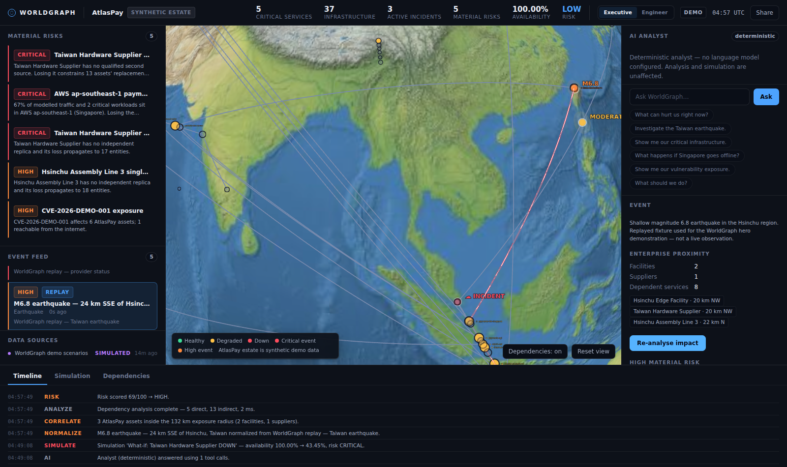
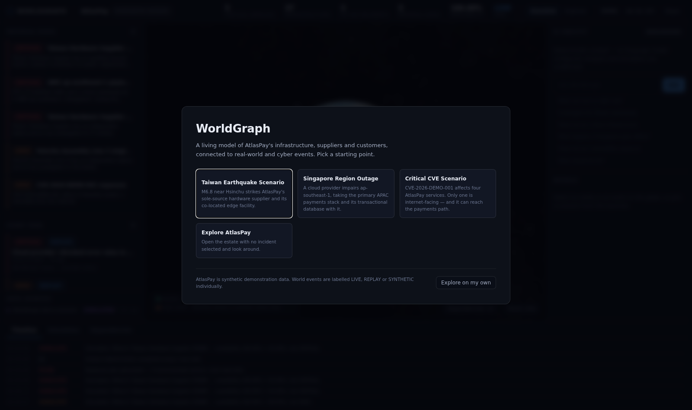
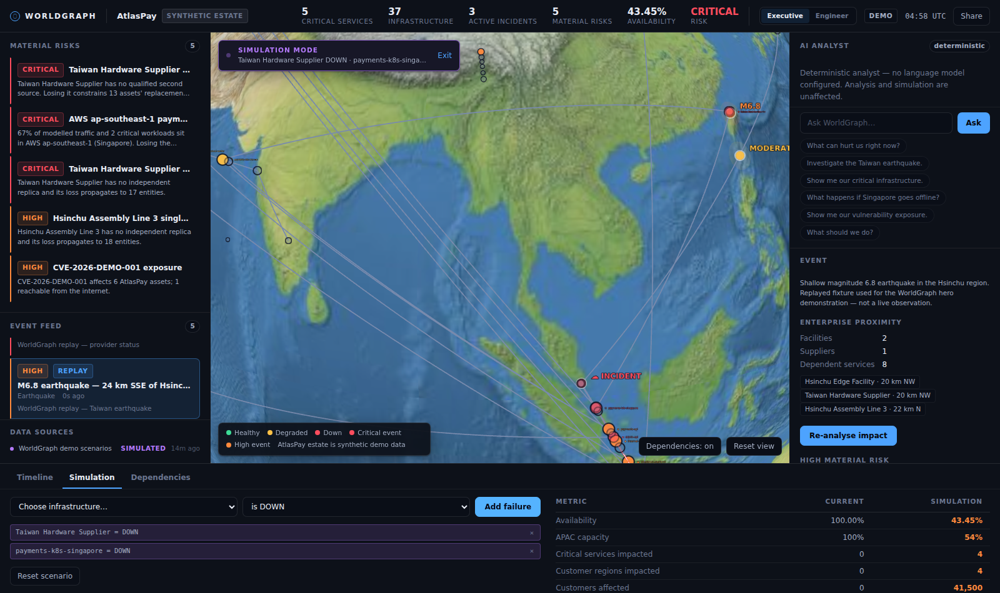

<div align="center">

# WorldGraph

**An AI-native cyber-physical resilience twin.**

*What is happening in the physical and digital world that can affect my company, what is
exposed, what happens next, and what should we do about it?*

[](#testing)
[](LICENSE)
[](#quick-start)

</div>

---

## What WorldGraph is

Most tools answer half the question. A map shows you an earthquake. A CMDB shows you your
infrastructure. A vulnerability scanner shows you CVEs. None of them tells you that the
earthquake in Taiwan just hit your sole-source hardware supplier, that the supplier feeds
your Singapore payments cluster, and that 38 % of your APAC customers sit at the end of that
chain.

WorldGraph builds a living model of an organisation — cloud regions, clusters, services,
databases, offices, suppliers, factories, customers — connects it to real-world and cyber
events, and answers the whole question:

```
REAL-WORLD OR CYBER EVENT
        ↓
DETECT AFFECTED ENTERPRISE ASSETS      ← deterministic geospatial + inventory correlation
        ↓
TRACE DEPENDENCY GRAPH                 ← bounded traversal that explains every hop
        ↓
CALCULATE BLAST RADIUS                 ← availability and capacity, solved separately
        ↓
SHOW IMPACT SPATIALLY                  ← the consequence lights up across the globe
        ↓
SIMULATE FAILURE SCENARIOS             ← what-if over a cloned world; nothing real changes
        ↓
GENERATE RESPONSE PLAN                 ← every recommendation carries its evidence
```

The engineering principle behind all of it: **deterministic before probabilistic.** Graph
traversal, geographic matching, impact arithmetic, risk scoring and simulation are code you
can unit-test and step through. The language model interprets intent, picks a tool, and
explains the result. It never computes a number and it never executes anything.

> **The demo runs with no accounts, no API keys and no network.** That is a design
> requirement, not a convenience: a demo that needs someone else's uptime is a demo that
> fails in the room where it matters.

### It also runs on estates that are not the demo

WorldGraph imports a real Azure subscription, read-only, into the same domain model the
demo uses — there is no Azure-specific analysis path. A cloud estate knows its topology and
almost nothing about its business meaning, so WorldGraph reports what it can compute and
says **UNKNOWN** to the rest, naming the missing input rather than filling the gap with a
plausible number:

```
Infra availability            38.33%     ← needs only the graph
Customers affected            UNKNOWN    ← no entity declares a customer count
Revenue at risk / hour        UNKNOWN    ← no revenue metadata in this workspace
Material risk       HIGH — Azure West Europe concentration
```

Three rules make that trustworthy, and each is enforced by tests rather than intent:

- **No fabricated dependencies.** An edge exists only where the resource's own `location`,
  an explicit resource-id reference in its configuration, or a human's
  `worldgraph.depends_on` tag proves one. A shared resource group, region or naming prefix
  proves nothing and produces nothing. Every edge carries its provenance.
- **Read-only, absolutely.** One Resource Graph query, `Reader` permission, no write client
  anywhere in the codebase — checked by CI, not asserted. Key Vaults are inventoried;
  their contents are never read.
- **Honest coverage.** What WorldGraph knows is reported dimension by dimension, never
  collapsed into one confidence score, alongside every resource type it could not model and
  every malformed tag it rejected.

`docs/REALITY_PASS_REPORT.md` is the engineering record of how far that goes — including
[§2](docs/REALITY_PASS_REPORT.md), which states plainly that the live connector has never
been run against a real subscription, and §9, which lists what is still not real.

---

## Screenshots

<div align="center">

| The hero moment — a Taiwan earthquake reaching APAC payments |
|---|
|  |

| First run | Baseline vs simulation |
|---|---|
|  |  |

</div>

*Captured by the Playwright suite in `frontend/tests/e2e/` — these are the actual product,
not mockups. Regenerate with `npm run test:e2e`.*

---

## Quick start

**Requirements:** Python 3.11+, Node 20+.

```bash
# 1. Backend  (terminal 1)
cd backend
pip install -r requirements.txt
uvicorn app.main:app --reload --port 8000

# 2. Frontend (terminal 2)
cd frontend
npm install
npm run dev
```

Open **http://localhost:5173**.

No configuration is required. `WORLDGRAPH_RUN_MODE` defaults to `DEMO`: deterministic replay
fixtures, no outbound network, no credentials. Copy `.env.example` to `backend/.env` to
enable live feeds or a model-backed analyst.

---

## Demo scenarios

The first-run launcher offers four starting points. Each is reproducible to the digit.

### 1. Taiwan Earthquake — the hero flow

1. Click **M6.8 earthquake — Hsinchu, Taiwan** in the event feed.
   The card shows 2 facilities, 1 supplier and 8 dependent services inside a modelled 132 km
   radius — and a `REPLAY` badge, because it is a fixture and never pretends otherwise.
2. Click **Analyze impact**. The globe reframes on Taiwan, recolours the estate, and animates
   the consequence travelling outward:
   `Taiwan Hardware Supplier → payments-k8s-singapore → payments-api → checkout-platform → Customer-facing payments → APAC customers`
3. Read the risk — **HIGH, 73/100** — with its full derivation, not a number:
   ```
   +19  critical asset impacted        Taiwan Hardware Supplier at 40% availability
    +3  customer-facing service degraded
   +13  single-region dependency with no failover
   +14  event proximity to enterprise assets
   +11  high severity event
    +3  customer traffic exposure
   +10  deep dependency propagation
   ```
4. Open **Simulation**, mark **Taiwan Hardware Supplier** `DOWN`:

   | | Current | Simulation |
   |---|---:|---:|
   | Availability | 100.00 % | 90.45 % |
   | APAC capacity | 100 % | **69 %** |
   | Critical services impacted | 0 | 4 |
   | Revenue at risk / hour | $0 | $382K |
   | Material risk | LOW | **HIGH** |

   Note what the model says here: traffic is still flowing at 90 %, but *replacement
   capacity* has collapsed to 69 %. That distinction is the whole point of
   [`capacity_impact`](docs/IMPACT_MODEL.md#3-capacity--and-why-it-is-solved-separately).
5. Add **payments-k8s-singapore** `DOWN`. Availability falls to 43 %, risk escalates to
   **CRITICAL**, and the cascading paths light up.
6. Type **"What should we do?"**:
   ```
   1. [NOW]     Shift traffic from payments-k8s-singapore to payments-k8s-mumbai.
      Why: payments-k8s-singapore is modelled at 0% availability while payments-k8s-mumbai
           serves the same workload and remains above 80%.
   2. [NOW]     Increase payments-k8s-mumbai capacity by 144%.
   3. [SOON]    Pause non-critical workloads (analytics-etl).
   4. [NOW]     Notify affected enterprise customers (SINGAPORE, MUMBAI, FRANKFURT).
   5. [MONITOR] Escalate Taiwan Hardware Supplier continuity review.
   ```
   Every action states *why*. Nothing is executed — `ResponseAction.executed` is
   `Literal[False]`, so "we did it" is unrepresentable in the schema.

### 2. Critical CVE — vulnerability to business impact

*"Show me our vulnerability exposure"* → four assets run the affected package, one is
internet-facing.

*"Which vulnerable systems can reach payments?"* →

```
Public internet → admin-api → internal-auth → payments-api
```

The last hop moves **against** the dependency arrow, because `payments-api` *trusts*
`internal-auth`. An egress-only reachability walk reports this path as nonexistent — which is
the wrong answer to the question, and the reason WorldGraph's attack traversal follows trust
as well as network egress.

This is the bridge from vulnerability management to business impact, rather than another CVE
dashboard.

### 3. Singapore Region Outage

A provider incident that names a region rather than giving coordinates, exercising the
non-geographic correlation path: an outage takes the primary APAC stack *and* its
transactional database, and the plan recommends promoting the Frankfurt replica.

### 4. Explore AtlasPay

The estate with nothing selected.

---

## The AI analyst

Ask in plain language:

> *What can hurt us right now? · Investigate the Taiwan earthquake. · What depends on
> payments-k8s-singapore? · What happens if Singapore goes offline? · Simulate losing Mumbai
> too. · Compare this scenario with normal operation. · Which customers would be affected? ·
> Why is payments high risk? · What should we do?*

**Two backends, one contract.** WorldGraph ships a deterministic intent router that maps
these onto the same 23 tools. Set `WORLDGRAPH_ANTHROPIC_API_KEY` and a model handles intent
instead — using the same tools and returning the same numbers. **The model adds language, not
facts.**

The router is not an untested fallback: every command above is pinned by a test. If the model
is unavailable, the analyst degrades to it and says so in a banner naming the reason.

### Why the model cannot go wrong in interesting ways

| Guard | How |
|---|---|
| It cannot compute | Every number comes from a deterministic tool result |
| It cannot invent infrastructure | Tools look entities up and refuse when absent |
| It cannot execute | No tool changes anything operational; only what-if scenarios are writable |
| It cannot escape | The registry is an allowlist — no `execute`, `shell`, `eval`, `http_get` or file access |
| It cannot be redirected by a feed | Feed text is sanitized, fenced and declared data; the architecture is what enforces it |
| It cannot mislabel a hypothetical | Simulation results carry `SIMULATED`, and the schema makes it a literal type |

Each of these is a test, not a promise: `backend/tests/test_ai.py`.

---

## Architecture

```
External feeds → Adapters → Normalization → World state → Dependency graph
                                                               ↓
                                         Correlation · Propagation · Blast radius
                                          Risk · Simulation · Response planning
                                                               ↓
                                                    AI tool layer (allowlisted)
                                                               ↓
                                                        Cesium globe + UI
```

- **Backend** — FastAPI, Pydantic, NetworkX, SQLite. Owns every secret, every deterministic
  engine, and the AI tool layer.
- **Frontend** — TypeScript (strict), Vite, CesiumJS, no UI framework. Renders and selects;
  holds no credentials.

Full detail — including why there *is* a backend, and why Neo4j is deliberately absent —
in **[`docs/ARCHITECTURE.md`](docs/ARCHITECTURE.md)**.

| Document | Contents |
|---|---|
| [`docs/ARCHITECTURE.md`](docs/ARCHITECTURE.md) | System shape, layers, trust boundaries, extension points |
| [`docs/DOMAIN_MODEL.md`](docs/DOMAIN_MODEL.md) | Entities, edges, events, analyses, simulations, plans |
| [`docs/IMPACT_MODEL.md`](docs/IMPACT_MODEL.md) | Every formula, with worked examples and stated limitations |
| [`docs/BASELINE_AUDIT.md`](docs/BASELINE_AUDIT.md) | Phase 0 audit: what was reused, removed, replaced, and the licensing blockers |
| [`SECURITY.md`](SECURITY.md) | Secret handling, the AI trust boundary, prompt injection, known limitations |
| [`THIRD_PARTY.md`](THIRD_PARTY.md) | Every dependency and data source with its license |

---

## Data sources

| Source | Data | License | Default |
|---|---|---|---|
| **USGS** | Realtime M2.5+ earthquakes | US Gov — public domain, no key | LIVE mode |
| **CISA KEV** | Known Exploited Vulnerabilities | US Gov — public domain, no key | LIVE mode |
| **Replay fixtures** | The three demo scenarios | Authored here | Always |
| **AtlasPay estate** | 42 entities, 56 edges | Authored here — **synthetic** | Always |

Every record carries `LIVE`, `REPLAY`, `SIMULATED` or `SYNTHETIC`, and the UI shows that
badge beside severity on every row. **WorldGraph never presents synthetic or simulated data
as live** — it is the product's central honesty control, and it is enforced by schema literal
types, not by convention.

Cesium Ion and Google Photorealistic 3D Tiles are opt-in. Without them the globe uses
Cesium's bundled public-domain Natural Earth II imagery.

---

## Simulation engine

```
Base world state → Scenario overlay → Recalculate → Compare
```

Applying a scenario **clones** the world. The real state is never mutated, which is what
makes the CURRENT vs SIMULATION table trustworthy: both columns come from the same engine run
against two worlds differing only by the operator's overrides.

Three override kinds — entity health, entity capacity, severed edge. Overrides naming an
unknown entity are **rejected**, not ignored: a simulation that looks like it ran and quietly
did nothing is the most dangerous possible outcome for a decision tool.

While a scenario is active, `SIMULATION MODE` is a persistent on-globe banner and the top-bar
figures switch to the simulated world — badged as such.

---

## Testing

```bash
cd backend  && pytest                    # 476 tests
cd frontend && npm run typecheck         # TypeScript strict
cd frontend && npm test                  # 30 unit tests
cd frontend && npm run test:e2e          # 15 Playwright specs (needs the backend running)
```

Every push runs all three in CI, plus a security workflow that builds the frontend with
decoy credentials in the environment and fails if any reaches the bundle, greps the backend
for write-capable cloud clients, and proves the app installs and passes with no cloud SDK
present at all.

| Suite | Covers |
|---|---|
| `test_graph.py` | Traversal both directions, cycle breaking, depth and node bounds, truncation reporting, fixture invariants |
| `test_impact_model.py` | Edge transfer, propagation, cycle convergence, capacity/availability divergence, business impact, **risk band boundaries** |
| `test_correlation.py` | Haversine (including antipodal and dateline), exposure radius, proximity falloff, CVE matching, **the trust-following attack path** |
| `test_simulation.py` | Non-mutation of the baseline, override compilation, comparison directions, response-plan rules |
| `test_adapters.py` | Normalization, malformed-record rejection, **feed-state honesty**, error messages that leak nothing |
| `test_ai.py` | Tool allowlist, argument validation, refusal to invent infrastructure, **six prompt-injection shapes**, every hero phrase routed |
| `test_api.py` | The API surface, rate limiting, and **`TestHeroFlow` — the 16-point Definition of Done end to end** |
| `test_unknowns.py` | **Absent is not zero** — every figure the engines used to invent, plus exact-value AtlasPay regression pins |
| `test_azure_inventory.py` | Normalization, **no fabricated edges**, secret redaction, the Key Vault rule, tag validation, **prompt injection via tags** |
| `test_workspaces.py` | Isolation in both directions at every layer, import failure modes, performance at 100 / 1 000 / 5 000 resources |
| `hero-demo.spec.ts` | The real UI in a real browser: first run, analysis, simulation, response plan, share links, console cleanliness |
| `workspaces.spec.ts` | Switching estates in a real browser: state cleared, coverage reported, no number invented, no leakage between workspaces |

The suites are load-bearing. Five real defects were found and fixed during initial
development rather than tested around — an orphaned graph node, an earthquake radius twice
too wide, a path-traversal sequence surviving id sanitization, a response plan recommending
customer notification over a 0.2 % impact, and a dependency arc that rendered through the
planet.

The Reality Pass found sixteen more, all sharing one root cause: absent and zero shared a
representation, so an estate that declared nothing summed to a confident zero. The worst
had WorldGraph reporting 100 % availability and $0 at risk for an estate it had just
modelled as entirely down. Three further defects surfaced only by driving the real UI
against a second estate — including an analyst that crashed on missing metadata and one
that described a datacenter in Singapore when asked about a fictional one in Reykjavik.
`docs/REALITY_PASS_AUDIT.md` and `docs/REALITY_PASS_REPORT.md` have the full accounting.

---

## Performance

| Target | Measured |
|---|---|
| Blast radius, demo graph | ~2 ms |
| Simulation recalculation | ~10 ms (budget: < 1 s) |
| Initial usable state | < 5 s |
| Globe idle cost | zero — `requestRenderMode`, continuous rendering held only during animations |

---

## Roadmap

**V1 is complete** for the workflow above. Next, in order:

1. **Run the Azure connector against a real subscription.** The import path is built,
   tested and validated against a recorded fixture; the ~20 lines that actually call Azure
   have never executed. Everything else on this list is less important than closing that
   gap. (`docs/REALITY_PASS_REPORT.md` §2.)
2. **Runtime dependencies.** Inventory cannot see a call graph, so an imported blast radius
   reaches only what hosting and explicit configuration prove — narrower than reality. A
   tracing source, or wider `worldgraph.depends_on` adoption, is what closes it.
3. **Health telemetry for imported estates.** Resource Graph reports existence, not health.
   Without Azure Monitor every imported entity is `UNKNOWN` health.
4. **Time.** The impact model has no MTTR, no recovery curve, no lead-time simulation.
   "Supplier down" is a state, not a schedule — and a supply-chain product should model the
   14 weeks.
5. **Authentication.** V1 has none. It is a single-operator tool; anything beyond that needs
   identity in front of it.

Then: partial traffic-shift simulation, correlated-failure modelling, more feeds behind the
existing adapter contract, and Postgres behind the existing repository interface.

**Deliberate non-goals for now:** CMDB/ServiceNow/Datadog integration, AWS and GCP,
production remediation execution, Neo4j, enterprise RBAC, billing, multi-tenancy, mobile.
The extension points are designed; those integrations are not built. Azure is the one
inventory source that is — read-only, one subscription per workspace.

---

## Licensing

WorldGraph's code is [MIT](LICENSE).

Its design was informed by an audit of
[God's Eye View](https://github.com/bilawalsidhu/gods-eye-view) (MIT, © 2026 Bilawal Sidhu),
recorded in [`docs/BASELINE_AUDIT.md`](docs/BASELINE_AUDIT.md). **No God's Eye View source
file, dataset, 3D model or asset is copied into or redistributed by this repository** — its
license would permit it, but its modules are entangled with subsystems WorldGraph removes, so
the ideas were reimplemented and credited in [`THIRD_PARTY.md`](THIRD_PARTY.md).

Every dependency is MIT, BSD-3-Clause or Apache-2.0. **No non-commercial data, no share-alike
data, no copyleft code, and no credential is required to run anything in this repository.**

---

<div align="center">
<sub><b>AtlasPay is fictional.</b> Its infrastructure, customers, revenue figures and the
vulnerability <code>CVE-2026-DEMO-001</code> are synthetic demonstration data. Every number
WorldGraph produces is a modelled estimate, and the product says so on every screen.</sub>
</div>
