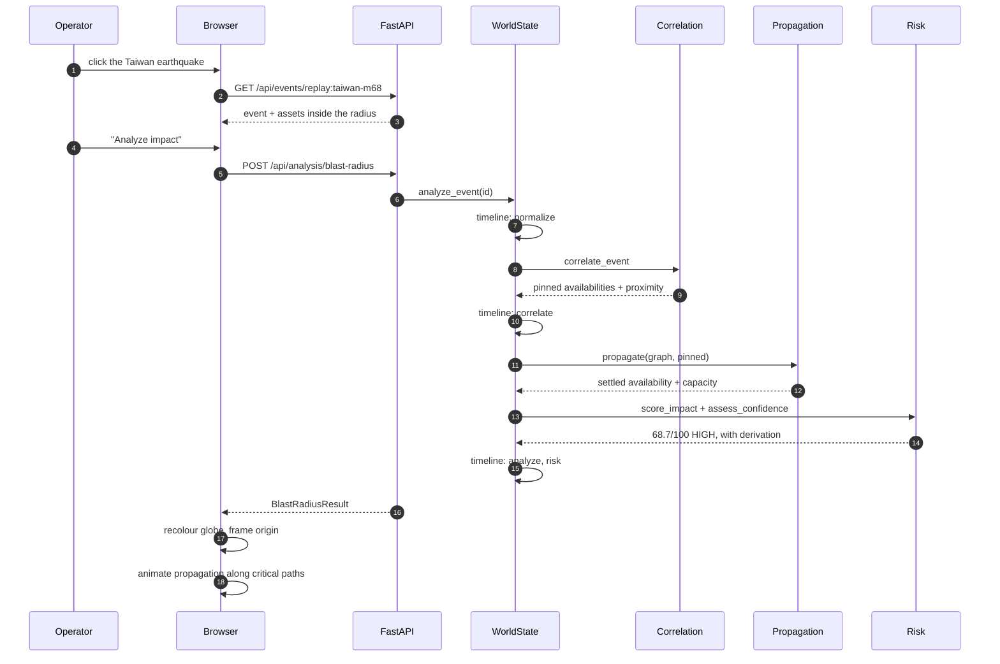

# WorldGraph Architecture

## The shape of the system

```mermaid
flowchart TB
    subgraph external["External signals"]
        USGS["USGS earthquakes<br/><i>public domain</i>"]
        KEV["CISA KEV catalog<br/><i>public domain</i>"]
        FIX["Replay fixtures<br/><i>deterministic</i>"]
    end

    subgraph backend["FastAPI backend — all secrets live here"]
        AD["Adapters<br/><small>one lifecycle, one honest state</small>"]
        NORM["Normalization + sanitization<br/><small>external text is data</small>"]
        WS["WorldState<br/><small>orchestration only</small>"]
        GR["WorldGraph<br/><small>NetworkX, bounded traversal</small>"]

        subgraph engines["Deterministic engines"]
            PROP["Propagation<br/><small>availability + capacity</small>"]
            CORR["Correlation<br/><small>geospatial + software</small>"]
            BLAST["Blast radius"]
            RISK["Risk scoring"]
            SIM["Simulation"]
            PLAN["Response plan"]
        end

        TOOLS["AI tool layer<br/><small>23 allowlisted, schema-validated</small>"]
        ANALYST["Analyst<br/><small>router · optional model</small>"]
        REPO[("SQLite<br/><small>behind a repository</small>")]
        API["HTTP API"]
    end

    subgraph frontend["Browser — no credentials"]
        GLOBE["Cesium globe"]
        PANELS["Panels"]
        CMD["Command bar"]
    end

    USGS --> AD
    KEV --> AD
    FIX --> AD
    AD --> NORM --> WS
    WS <--> GR
    GR --> PROP --> BLAST
    CORR --> BLAST
    BLAST --> RISK
    BLAST --> PLAN
    GR --> SIM --> BLAST
    WS <--> REPO
    WS --> TOOLS --> ANALYST
    WS --> API
    TOOLS --> API
    API --> GLOBE
    API --> PANELS
    CMD --> API

    style engines fill:#0d1119,stroke:#4da3ff
    style backend fill:#090c14,stroke:#2a3348
    style frontend fill:#090c14,stroke:#2a3348
```



The one rule that shapes everything: **deterministic before probabilistic.** Graph
traversal, geographic matching, impact arithmetic, risk scoring and simulation are code. The
language model interprets intent, chooses a tool, and explains the result.

---

## Why a backend at all

God's Eye View, the architectural baseline, has none — its 7,383-line `vite.config.js` hosts
every external call and every credential inside Vite dev middleware. `docs/BASELINE_AUDIT.md`
records why WorldGraph does not inherit that:

1. **Credential custody.** Vite middleware does not survive `vite build`. WorldGraph's keys
   live in a process the browser cannot reach.
2. **Testable engines.** Blast radius, risk and simulation are the product. In typed Python
   next to the data they get 483 unit tests; in a browser bundle they would get screenshots.
3. **A tool layer the client cannot drive.** If AI tools run in the browser, a compromised
   client invokes them directly. Server-side, every call is schema-validated and allowlisted.

---

## Request flow: the hero moment



Every stage writes a timeline entry. A developer can open the Timeline dock and read exactly
why an analysis reached HIGH, rather than being told a number.

---

## Layers

### Adapters — `backend/app/adapters/`

One contract: `initialize → start → stop → refresh → get_status`, with exactly one honest
`FeedState`. The lifecycle and the "a feed has one state, and guidance states are not
faults" insight come from God's Eye View's `DataLayerManager` (MIT, reimplemented).

Two rules that matter more than the interface:

- **A failed refresh never clears held data.** The adapter reports `DEGRADED` and keeps
  serving. A globe that blinks empty on every upstream hiccup teaches operators to distrust
  it.
- **Errors are user-safe by construction.** Only the exception *type* and a fixed
  explanation escape `_describe_error`. An upstream body is exactly where a key ends up.

Adding a source means writing `fetch()` and returning normalized records. The registry, the
scheduler and the status reporting are inherited.

### Graph — `backend/app/graph/world_graph.py`

A `MultiDiGraph` over NetworkX with an explicit direction convention (`dependent → dependency`,
so failure flows *against* the arrows) stated once instead of re-derived at every call site.

Every traversal is bounded (depth 12, 5,000 nodes), carries an explanation path rather than a
set of ids, breaks cycles instead of looping, and **reports truncation** — a silently
truncated blast radius is worse than none.

### Engines — `backend/app/analysis/`, `simulation/`

Pure functions over the graph. No I/O, no framework, no model. Documented in
`docs/IMPACT_MODEL.md`. Simulation operates on a `clone()` of the world, which is why
"baseline vs simulated" is trustworthy: both columns come from the same engine against two
worlds differing only by the operator's overrides.

### AI — `backend/app/ai/`

```mermaid
flowchart LR
    OP["Operator question"] --> A{"Analyst<br/>backend"}
    A -->|"key configured"| M["Anthropic tool-use loop<br/><small>bounded, 8 rounds</small>"]
    A -->|"no key, or model failed"| D["Intent router<br/><small>always available</small>"]
    M --> T["Tool registry<br/><small>23 allowlisted</small>"]
    D --> T
    T --> E["Deterministic engines"]
    E --> ANS["Answer + directives"]
    style T fill:#0d1119,stroke:#4da3ff
```



The registry is the security boundary. There is no `execute`, no `http_get`, no `eval`, no
file access. Only four tools mutate anything, and what they mutate is what-if scenarios that
exist inside WorldGraph and affect nothing real.

The **deterministic intent router is the shipped analyst**, not a fallback nobody tests.
Every natural-language command in the product specification routes through it, pinned by
tests. When a model is configured it uses the same tools and gets the same numbers — the
model adds language, not facts.

### Storage — `backend/app/storage/`

SQLite behind an abstract `Repository`. Records are validated JSON in a `payload` column with
query-relevant fields promoted to real columns: a V1 trade that avoids a migration for every
field while covering every query the API makes. Swapping in Postgres is a new implementation
of the same interface.

**Neo4j is deliberately absent** (a stated non-goal). The graph is ~60 nodes; a real
mid-size estate is thousands. NetworkX plus relational storage answers every question V1
asks, and a graph database would be infrastructure without a problem.

### Frontend — `frontend/src/`

```
main.ts        composition root and the workflows that span globe + panels
globe/         viewer, entity layer, palette
ui/            DOM helpers and pure panel renderers
state/         observable store, share-link codec
api/           typed client with request cancellation
styles/        design tokens, shell, panels
```

Rendering is a single pass driven by store subscription. At this state size a whole-panel
rebuild is cheaper than diffing and removes an entire class of "the panel and the globe
disagree" bug. No UI framework: the state is a selection, a mode, an analysis and a
scenario.

`ui/dom.ts::el()` throws on an `html` attribute. Every string WorldGraph renders may have
come from a feed, and that function is the single chokepoint keeping them text.

---

## Performance

| Budget | Measured |
|---|---|
| Blast radius on the demo graph | ~2 ms |
| Simulation recalculation | ~10 ms (budget: < 1 s) |
| Initial usable state | < 5 s |
| Globe interaction | on-demand rendering; idle frames cost nothing |

Cesium runs with `requestRenderMode`. Discrete changes request one frame; only the
propagation animation holds continuous rendering, and it releases on completion. All globe
geometry is static — the baseline measured a pulsing ground ellipse at 32.4 ms/frame for 58
discs against 1.4 ms/frame static, and WorldGraph inherits the lesson rather than repeating
the experiment.

---

## Workspaces and inventory import

A **workspace** is a self-contained world: its own entities, edges, events, simulations and
analyses. AtlasPay is one; an imported Azure subscription is another.

Isolation is **structural rather than filtered**. Each workspace owns a separate
`WorldState` with its own graph and its own repository file, and the registry hands out the
right one. There is no shared collection with a `workspace_id` column, because a shared
collection is exactly how the cross-contamination bug gets written — and a blast radius
that leaked from a demo fixture into a real subscription is the worst failure this product
could produce.

```
WorkspaceRegistry
├── atlaspay-demo   → WorldState(graph, events, scenarios) → worldgraph.db
└── azure-<sub>     → WorldState(graph, events, scenarios) → worldgraph.azure-<sub>.db
```

`registry.state(id)` **raises** for a workspace that exists but is not loaded. It never
falls back to the default; a silent fallback would answer a question about an Azure
subscription with data from a demo fixture. Over the API that is a 409 with the reason.

Requests carry the workspace as a query parameter, resolved once in `get_state`, so every
existing route became workspace-aware without touching its body. The analyst is built per
workspace and cached, because an analyst is bound to a world and answering one estate's
question with another's tools would be the same contamination bug one layer up.

### The import path

```
Azure Resource Graph  →  normalize  →  WorldEntity + DependencyEdge  →  the same engines
```

There is no Azure-specific analysis path, and that is the point of the design: an Azure
resource becomes an ordinary `WorldEntity`, and traversal, blast radius, risk, simulation
and the AI layer operate on it unchanged.

Three modules, each with one job:

| Module | Responsibility |
|---|---|
| `adapters/azure_regions.py` | Region → approximate coordinates. Returns `None` for an unrecognised region: an entity at the wrong place on a globe is worse than one with no place, because a wrong marker invites a conclusion. |
| `adapters/azure_tags.py` | The `worldgraph.*` namespace. Optional, explicit, validated, read-only. A malformed value is rejected and reported, never guessed at. |
| `adapters/azure_inventory.py` | Query, sanitize, normalize, infer defensible edges, assess coverage. |

**Edges only where something proves one.** A resource's `location` proves `HOSTED_IN`; an
explicit resource-id reference in its configuration proves `CONNECTS_TO`; a human's
`worldgraph.depends_on` tag declares `DEPENDS_ON` — the only edge inventory can never
justify on its own. A shared resource group, region, naming prefix or creation time proves
nothing and produces nothing. Every edge carries `{source, method, confidence}` so a reader
can always separate what Azure proved from what a person asserted.

**Coverage is reported per dimension, never as one score.** Averaging "complete hosting
topology" with "nothing about business services" yields a number that looks precise and
means nothing; the operator needs the shape of the gap, because that is what says which tag
to add.

See `SECURITY.md` §9 for the read-only, secret-handling and tag-trust properties, and
`docs/REALITY_PASS_REPORT.md` for what has and has not actually been verified.

---

## Extension points (designed, not built)

The non-goals list is long on purpose. What exists is the seam, not the integration:

| To add | Where |
|---|---|
| A cloud/observability/security feed | Subclass `WorldDataAdapter`, register it |
| A new entity or edge type | Extend the enum; scoring rules are greppable by field |
| Postgres | Implement `Repository` |
| A new AI capability | Register a `Tool` with a Pydantic schema |
| A different impact model | Replace `propagation.py`; its interface is two dicts |

| An inventory source for a new provider | Return `(entities, edges, ImportSummary)`; register a `Workspace` from `Settings` |

Not built: CMDB/ServiceNow/Datadog/AWS/GCP inventory sync, production remediation
execution, Neo4j, RBAC, billing, multi-tenancy. Azure inventory import **is** built, and is
read-only.

---

## Trust boundaries

```mermaid
flowchart LR
    subgraph untrusted["Untrusted"]
        FEED["Feed text<br/><small>titles, CVE prose, status messages</small>"]
        CLIENT["Browser"]
    end
    subgraph trusted["Trusted"]
        SYS["System prompt"]
        ENG["Engines"]
        SEC["Secrets"]
    end
    FEED -->|"sanitized, fenced,<br/>never instructions"| ENG
    CLIENT -->|"schema-validated,<br/>rate-limited"| ENG
    SYS --> ENG
    SEC -.->|"never crosses"| CLIENT
    style untrusted fill:#1a0f14,stroke:#ff4d5e
    style trusted fill:#0d1119,stroke:#3ddc97
```



Feed text is **data**, never instructions — enforced architecturally (the model can only call
allowlisted tools that compute over WorldGraph's own data) and defended in depth
(sanitization, explicit fencing, a system prompt that names the hierarchy). A successful
injection can make the analyst say something wrong; it cannot make it *do* something.

Full detail in [`SECURITY.md`](../SECURITY.md).
