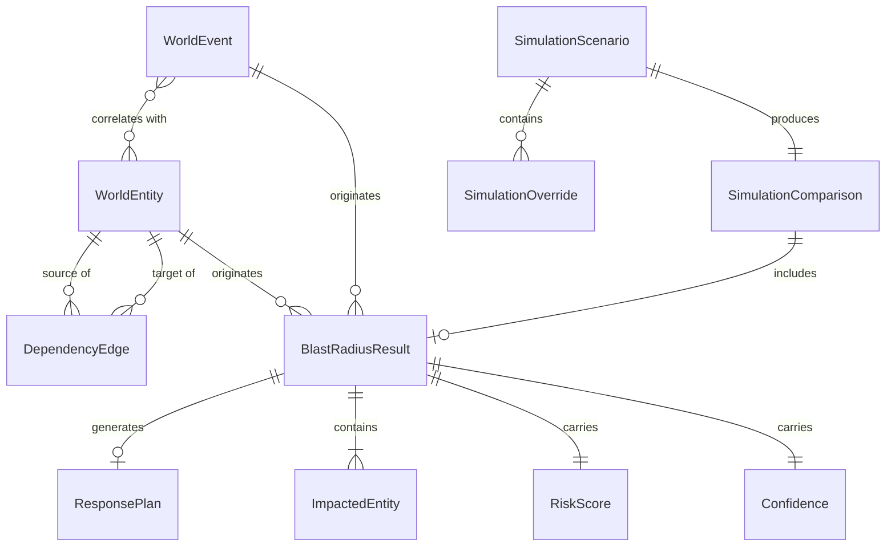

# WorldGraph Domain Model

Everything WorldGraph reasons about is one of three things, plus the records its engines
produce about them.



---

## 1. `WorldEntity` — a node in the world

Entities and edges are stored **separately** on purpose. A marker on a map cannot answer
"what breaks if this fails"; a graph can. Keeping edges out of the entity record is what lets
the blast-radius engine traverse without loading presentation state.

```python
class WorldEntity:
    id: str                    # slug; validated, because it reaches URLs
    type: EntityType
    name: str
    location: GeoPoint | None
    health: HealthState
    criticality: Criticality

    business: BusinessProfile   # traffic, revenue, customers, SLA, capacity, redundancy
    exposure: ExposureProfile   # internet_facing, network_zone, authenticated
    software: list[SoftwareComponent]

    metadata: dict[str, Any]    # adapter-specific; NEVER read by scoring
    source: DataSourceInfo      # mandatory provenance
```

**Why the typed sub-profiles exist.** Anything the engines read gets a typed home, so a
scoring rule is always greppable. `metadata` is for adapter colour — a rule that reached into
it would be invisible to anyone auditing the model. (Three metadata keys are read by the
*planner*, not the scorer: `promotable`, `pausable`, `second_source_qualified`. Each is
documented at its use site.)

### Entity types

| Family | Types | Physical? |
|---|---|---|
| Business | `ORGANIZATION`, `BUSINESS_SERVICE`, `APPLICATION` | no |
| Software | `MICROSERVICE`, `DATABASE`, `KUBERNETES_CLUSTER`, `EXTERNAL_API` | no |
| Sites | `CLOUD_REGION`, `DATACENTER`, `OFFICE`, `FACTORY`, `NETWORK_NODE` | **yes** |
| Supply | `SUPPLIER` | **yes** |
| Demand | `CUSTOMER_REGION` | no |
| Signals | `SECURITY_FINDING`, `WORLD_EVENT` | no |

"Physical" is not cosmetic: only physical entities correlate geographically. A microservice
is not "near" an earthquake — it inherits impact through the site hosting it.

Cloud regions count as physical. A region is a real building.

The set is **closed**. An open string field would let an adapter invent types the traversal,
scoring and UI layers have no rules for.

---

## 2. `DependencyEdge` — a typed, weighted relationship

```python
class DependencyEdge:
    source_entity_id: str      # the DEPENDENT
    target_entity_id: str      # the DEPENDENCY
    type: DependencyType
    criticality: float         # 0-1: how much of source's function target carries
    redundancy: float          # 0-1: how much of that loss failover absorbs
    capacity_impact: float | None   # 0-1, defaults to criticality
```

**Direction is always dependent → dependency.** `payments-api DEPENDS_ON postgres-singapore`
means `payments-api` is the source. Failure therefore propagates **backwards** along edges.
Traversal code names this explicitly rather than relying on the reader's intuition.

| Type | Meaning | Failure flows |
|---|---|---|
| `DEPENDS_ON` | source needs target | target → source |
| `HOSTED_IN` | source runs on target | target → source |
| `CONNECTS_TO` | source reaches target over a network | target → source |
| `SUPPLIED_BY` | source is supplied by target | target → source |
| `SERVES` | source provides a service to target | source → target |
| `REPLICATES_TO` | source replicates to target | **neither** |

`REPLICATES_TO` propagating nothing is the point of a replica: losing the copy must not take
the primary with it.

### `capacity_impact` — the model's load-bearing idea

Availability and capacity come apart precisely where supply chains do. Losing a hardware
supplier does not switch a running cluster off (small `criticality`) but does remove the
ability to replace failed nodes or grow (large `capacity_impact`). Conflating them is how a
naive model turns "constrained replacement capacity" into a fictional outage.

Self-edges are rejected at validation: they are always a data bug and would poison cycle
detection.

---

## 3. `WorldEvent` — something that happened

```python
class WorldEvent:
    id: str
    category: EventCategory
    title: str
    description: str           # UNTRUSTED external text
    severity: Severity
    location: GeoPoint | None
    exposure_radius_km: float
    occurred_at: datetime
    source: DataSourceInfo
    metadata: dict[str, Any]   # magnitude, depth_km, cve_id, cvss…
    directly_named_entity_ids: list[str]
```

Two correlation paths, because events are not all alike:

- **Geographic** — coordinates and a radius (earthquakes, storms, fires).
- **Named** — no useful geometry, but the source names a region. A provider status page says
  "ap-southeast-1 is impaired"; that is stronger evidence than any distance calculation, and
  it outranks one for the same entity.
- **Inventory** — a CVE has no location at all and matches on software.

`description` is written by strangers. It is sanitized on ingest, rendered as text (never
markup), and reaches the model inside a field explicitly named `untrusted_description`.

---

## 4. Provenance — `DataSourceInfo`

Not optional. Every entity and every event carries it.

```python
class DataSourceInfo:
    source_id: str
    source_name: str
    source_url: str | None
    mode: DataMode              # LIVE | REPLAY | SIMULATED | SYNTHETIC
    confidence: float
    observed_at: datetime | None
    ingested_at: datetime
```

`mode` is **the single most important honesty control in the product**. WorldGraph mixes real
world signals with a synthetic enterprise estate and hypothetical simulations. A record that
could not say which it was would be a lie waiting to happen.

| Mode | Meaning |
|---|---|
| `LIVE` | observed by a real feed, now |
| `REPLAY` | a recorded fixture, replayed on a fixed clock |
| `SIMULATED` | a hypothetical world state |
| `SYNTHETIC` | invented — the entire AtlasPay estate |

Every event row in the UI carries this badge beside its severity. An operator never has to
hunt for whether a thing on their globe is real.

`observed_at` and `ingested_at` are separate because they differ, sometimes by a lot, and
freshness is computed against observation rather than delivery.

---

## 5. `FeedStatus` — an adapter's one honest state

| State | Meaning |
|---|---|
| `LOADING` | first fetch in flight |
| `LIVE` | fresh data from upstream |
| `DEGRADED` | upstream failing, **serving previously fetched data** |
| `STALE` | last success is older than the adapter's threshold |
| `FALLBACK` | serving a secondary source |
| `SIMULATED` | replay or synthetic by design |
| `UNAVAILABLE` | failing with no data to serve |

Exactly one state at a time. The stale check happens at *read* time, not refresh time: a feed
does not become stale only when someone asks it to refresh.

---

## 6. Analysis records

### `BlastRadiusResult`

Explainable by construction. Nothing in it exists without its derivation:

- `direct_impact` / `indirect_impact` — `ImpactedEntity`, split at depth 1, each carrying the
  `ImpactPath` that reached it;
- `critical_paths` — routes terminating at customer-facing or CRITICAL entities;
- `customer_exposure` — per-region traffic impact and modelled customer counts;
- `business_impact` — headline figures, with `disclaimer: Literal["MODELLED ESTIMATE"]`;
- `risk` — a score **plus its signed contributions**;
- `confidence` — a score **plus its evidence and its uncertainties**;
- `truncated` / `truncation_reason` / `cycles_detected` — traversal honesty.

`ScoreContribution.code` is machine-stable so tests assert on it; `label` is prose that can
be reworded freely.

### `SimulationScenario` and `SimulationOverride`

An override is a hypothetical: entity health, entity capacity, or a severed edge. Applying a
scenario clones the world — **the real state is never mutated**, which is what makes
"baseline vs simulated" trustworthy.

`SimulationScenario.mode` is `Literal[DataMode.SIMULATED]`: it cannot be anything else.

`SimulationComparison` carries both snapshots, per-row `MetricDelta`s whose `direction` is
*computed* (so a scenario that improves something is coloured honestly), the entities newly
degraded by the scenario, and the cascading paths.

### `ResponsePlan` and `ResponseAction`

```python
class ResponseAction:
    action: str
    rationale: str = Field(min_length=1)   # mandatory by schema
    urgency: NOW | SOON | MONITOR
    confidence: float
    requires_approval: bool
    executed: Literal[False]               # cannot be anything else in V1
```

Two schema-level guarantees, chosen over documentation because documentation is not enforced:
an action **cannot exist without a rationale**, and `executed` **cannot be true**.

### `TimelineEntry` and `MaterialRisk`

The timeline is written by the engines, not the UI, so what it records is what actually
happened. `MaterialRisk` is a *standing* structural risk — concentration, single sourcing,
reachable vulnerable surface — derived from graph shape rather than asserted by a human, so
changing the estate changes the risk register without anyone editing a constant.

---

## 7. The AtlasPay fixture

42 entities, 56 edges, a fixed epoch, entirely invented. Real coordinates (the globe has to
look right); imaginary facilities.

```
AtlasPay
├── customer-facing payments ── checkout-platform ─┬─ payments-api ─┬─ payments-k8s-{singapore,mumbai}
│                                                  │                ├─ postgres-singapore ─ replica(frankfurt)
│                                                  │                ├─ redis-mumbai
│                                                  │                ├─ fraud-service ── fraud-k8s-singapore
│                                                  │                ├─ internal-auth
│                                                  │                └─ card-network-apac ── dc-singapore-partner
│                                                  └─ checkout-worker
├── merchant onboarding ────── customer-portal ──── portal-k8s-frankfurt
├── settlement reporting ───── analytics-platform ─ analytics-etl ── warehouse-virginia
├── supply ── supplier-taiwan-hardware ── factory-taiwan-assembly
├── exposure ── internet ── admin-api ── internal-auth ── payments-api
└── serves ── customers-{apac, india, emea, amer}
```

Three structural properties the demo depends on, each asserted by a test:

1. **A sole-source supplier with no second source.** `supplier-taiwan-hardware` has
   `redundancy = 1` and `second_source_qualified: False` — the standing material risk, and
   the thing the Taiwan earthquake hits.
2. **One internet-facing vulnerable service that can reach payments.**
   `internet → admin-api → internal-auth → payments-api`. The last hop moves *against* the
   dependency arrow because `payments-api` trusts `internal-auth` — which is why the attack
   walk follows trust as well as egress.
3. **A promotable cross-region replica.** `postgres-frankfurt-replica` is what makes the
   response plan's "promote the replica" recommendation derivable rather than scripted.

The estate is one connected component with no cycles, its customer traffic shares sum to 1.0,
and every entity is `SYNTHETIC`. All four are tests, not conventions — `test_graph.py::TestAtlasPayFixture`.
